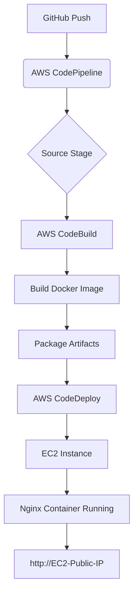
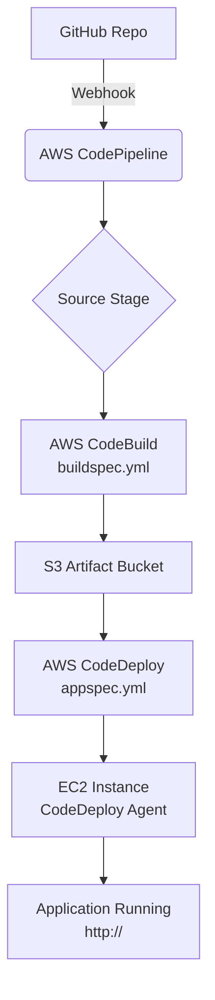

# 🚀 AWS CI/CD Pipeline: Deploy Nginx on EC2 with CodePipeline, CodeBuild & CodeDeploy


A **fully automated CI/CD pipeline** using **AWS CodePipeline**, **CodeBuild**, and **CodeDeploy** to build, test, and deploy a **containerized Nginx web server** on an **EC2 instance**. The source code is hosted on GitHub, and every push triggers an automated deployment.

---

## 📘 Project Overview

This project demonstrates **end-to-end DevOps automation** on AWS:

- **Source Control**: GitHub  
- **CI/CD Orchestration**: AWS CodePipeline  
- **Build & Containerization**: AWS CodeBuild + Docker  
- **Deployment**: AWS CodeDeploy (In-place)  
- **Target**: EC2 Instance (Amazon Linux 2/2023)  
- **Application**: Custom Nginx container serving static HTML/CSS/JS

> **Goal**: Push code → Auto-build Docker image → Deploy to EC2 → Live in seconds

---

## 🛠️ Architecture Diagram



---

## 🧰 Tools & AWS Services Used

| Service             | Purpose |
|---------------------|--------|
| **GitHub**          | Source code repository |
| **AWS CodePipeline**| Orchestrates the CI/CD workflow |
| **AWS CodeBuild**   | Builds Docker image and prepares artifacts |
| **AWS CodeDeploy**  | Deploys application to EC2 |
| **Amazon EC2**      | Target server running Docker |
| **Docker**          | Containerizes Nginx app |
| **IAM Roles**       | Secure access between services |
| **Security Groups** | Controls inbound/outbound traffic |
| **CloudWatch Logs** | Monitors build/deploy logs |

---

## 📦 Repository Structure

```bash
.
├── Dockerfile              # Builds Nginx image with custom site
├── buildspec.yml           # CodeBuild instructions
├── appspec.yml             # CodeDeploy deployment config
├── index.html              # Homepage content
├── style.css               # Styling
├── index.js                # Optional JS
└── scripts/
    ├── start_container.sh  # Starts/restarts Docker container
    ├── stop_container.sh   # Stops old container
    └── validate_service.sh # Health check script
```

---

## 🔄 CI/CD Pipeline Stages (Detailed)

### 1. **Source Stage** (`CodePipeline`)
- **Trigger**: GitHub webhook on `push` to `main`
- **Action**: Downloads latest code
- **Output**: Zipped source code

### 2. **Build Stage** (`CodeBuild`)
- **Runtime**: `aws/codebuild/standard:7.0` (or custom Docker)
- **Commands** (from `buildspec.yml`):
  ```yaml
  phases:
    build:
      commands:
        - echo "Building Docker image..."
        - docker build -t nginx-app .
        - mkdir -p deploy_package
        - cp -r Dockerfile appspec.yml scripts/ index.html style.css index.js deploy_package/
    post_build:
      commands:
        - echo "Packaging artifacts..."
        - cd deploy_package && zip -r ../nginx-deploy-package.zip .
  artifacts:
    files: nginx-deploy-package.zip
  ```

### 3. **Deploy Stage** (`CodeDeploy`)
- **Deployment Type**: **In-place**
- **Target**: EC2 tagged with `CodeDeployDemo`
- **Lifecycle Hooks** (via `appspec.yml`):
  ```yaml
  hooks:
    BeforeInstall:
      - location: scripts/stop_container.sh
        timeout: 300
        runas: ec2-user
    AfterInstall:
      - location: scripts/start_container.sh
        timeout: 300
        runas: ec2-user
    ValidateService:
      - location: scripts/validate_service.sh
        timeout: 300
        runas: ec2-user
  ```

---

## 🔧 Deployment Scripts (Detailed)

### `scripts/start_container.sh`
```bash
#!/bin/bash
docker rm -f nginx-app 2>/dev/null || true
docker run -d \
  --name nginx-app \
  -p 80:80 \
  -v /home/ec2-user/app:/usr/share/nginx/html:ro \
  nginx-app:latest
```

### `scripts/stop_container.sh`
```bash
#!/bin/bash
docker stop nginx-app 2>/dev/null || true
docker rm nginx-app 2>/dev/null || true
```

### `scripts/validate_service.sh`
```bash
#!/bin/bash
sleep 10
if curl -s http://localhost/ | grep -q "Welcome"; then
  echo "App is running!"
  exit 0
else
  echo "App failed to start!"
  exit 1
fi
```

---

## 🔐 Security Best Practices

| Component | Security Measure |
|--------|------------------|
| **IAM Roles** | Least privilege for CodeBuild & CodeDeploy |
| **EC2 Instance** | No public SSH (use Session Manager) |
| **Security Group** | Allow only `HTTP (80)` and `HTTPS (443)` inbound |
| **CodeBuild** | VPC-enabled (optional for private subnets) |
| **Secrets** | Use AWS Secrets Manager or SSM (not in repo) |

---

## 🚀 How to Set Up (Step-by-Step)

### Prerequisites
- AWS Account with CLI configured
- EC2 Instance (Amazon Linux) with:
  - Docker installed
  - CodeDeploy agent installed
  - Tagged: `Key=Name, Value=CodeDeployDemo`
- GitHub repository (this one)

---

### Step 1: Prepare EC2 Instance

```bash
# Connect to EC2
ssh -i your-key.pem ec2-user@your-ec2-ip

# Install Docker
sudo yum update -y
sudo amazon-linux-extras install docker
sudo service docker start
sudo usermod -a -G docker ec2-user

# Install CodeDeploy Agent
sudo yum install -y ruby wget
cd /home/ec2-user
wget https://aws-codedeploy-us-east-1.s3.amazonaws.com/latest/install
chmod +x ./install
sudo ./install auto
sudo service codedeploy-agent start
```

---

### Step 2: Create IAM Roles

#### 1. **CodeBuild Role** (`CodeBuildServiceRole`)
Policies:
- `AWSCodeBuildAdminAccess`
- `AmazonEC2ContainerRegistryPowerUser` (if using ECR)
- Custom policy for S3 artifact access

#### 2. **CodeDeploy Role** (`CodeDeployServiceRole`)
- `AWSCodeDeployRole`

#### 3. **EC2 Instance Role** (`EC2CodeDeployRole`)
- Attach `AmazonSSMManagedInstanceCore` (for Session Manager)

---

### Step 3: Create CodePipeline

1. Go to **AWS CodePipeline** → Create Pipeline
2. **Source**: GitHub (v2) → Connect & Select Repo
3. **Build**: Create new CodeBuild project
   - Environment: Managed Image → `aws/codebuild/amazonlinux2-x86_64-standard:5.0`
   - Buildspec: Use `buildspec.yml` from repo
4. **Deploy**: CodeDeploy
   - Application Name: `NginxApp`
   - Deployment Group: `NginxFleet` (create if needed)

---

### Step 4: Push Code to Trigger Pipeline

```bash
git clone https://github.com/adarsh0331/AWS-CICD-Project.git
cd AWS-CICD-Project
echo "<h1>Hello from $(date)</h1>" >> index.html
git add .
git commit -m "Update homepage"
git push origin main
```

Pipeline runs automatically!

---

## ✅ Testing the Deployment

1. Get EC2 Public IP
2. Open browser: `http://<EC2-Public-IP>`
3. You should see your custom Nginx page

---

## 📊 Monitoring & Logging

| Tool | Purpose |
|------|--------|
| **CodePipeline Console** | View pipeline status |
| **CodeBuild Logs** | Build errors |
| **CodeDeploy Console** | Deployment history & rollback |
| **CloudWatch Logs** | `/aws/codebuild/...`, `/aws/codedeploy/...` |
| **EC2 System Logs** | `docker logs nginx-app` |

---

## 🔄 Rollback Strategy

- CodeDeploy automatically rolls back on:
  - Failed `ValidateService`
  - Timeout in any hook
- Manual rollback via Console → "Rollback"

---

## 🧪 Local Testing (Optional)

```bash
# Build and run locally
docker build -t nginx-local .
docker run -d -p 8080:80 nginx-local
curl http://localhost:8080
```

---

## ⚙️ Customization Ideas

| Idea | How |
|------|-----|
| Use **ECR** | Push image in `buildspec.yml` |
| **Blue/Green** | Change deployment type in CodeDeploy |
| **ALB + Target Group** | For high availability |
| **Terraform** | IaC for all resources |
| **GitHub Actions** | Alternative to CodePipeline |

---

## 🚨 Troubleshooting

| Issue | Solution |
|------|----------|
| Pipeline stuck in Source | Check GitHub token permissions |
| Build fails (Docker not found) | Use correct CodeBuild image with Docker |
| Deploy fails (Permission denied) | Check IAM role & EC2 user |
| Port 80 not open | Update Security Group |
| Old container not stopping | Check `stop_container.sh` logs |

---

## 📚 References & Documentation

- [AWS CodePipeline User Guide](https://docs.aws.amazon.com/codepipeline/latest/userguide/welcome.html)
- [AWS CodeBuild Docs](https://docs.aws.amazon.com/codebuild/latest/userguide/welcome.html)
- [AWS CodeDeploy Docs](https://docs.aws.amazon.com/codedeploy/latest/userguide/welcome.html)
- [Docker on EC2](https://docs.aws.amazon.com/AmazonECS/latest/developerguide/docker-basics.html)
- [Nginx Docker Hub](https://hub.docker.com/_/nginx)

---

## 👨‍💻 Author

**Adarsh Singh**  
[GitHub: @adarsh0331](https://github.com/adarsh0331)  
[LinkedIn](https://linkedin.com/in/adarsh-singh) *(update link)*

---

## 📄 License

This project is licensed under the **MIT License** - see [LICENSE](LICENSE) for details.

---

**⭐ Star this repo if you found it helpful!**  
**🚀 Happy Deploying!**
```

---
---


---

# 🚀 AWS CI/CD Pipeline: Deploying a Web Application to EC2

> **Automate. Deploy. Scale.**  
> A complete end-to-end CI/CD pipeline using **AWS CodePipeline**, **CodeBuild**, and **CodeDeploy** to deploy a static or dynamic web application from GitHub to an EC2 instance.

---

## 📘 Overview

This project demonstrates a **fully automated CI/CD pipeline** that:

1. Detects code changes in a **GitHub repository**
2. Builds and packages the application using **AWS CodeBuild**
3. Deploys the updated app to **EC2** via **AWS CodeDeploy**
4. Uses **lifecycle hooks** for safe start/stop of services

Ideal for:
- Static websites (HTML/CSS/JS)
- Node.js, Python (Flask/Django), or PHP apps
- Learning AWS DevOps services

---

## 🛠️ Architecture Diagram



---

## 📦 Repository Structure

```
├── buildspec.yml              # CodeBuild instructions
├── appspec.yml                # CodeDeploy deployment config
├── index.html                 # Sample app (replace with your app)
├── scripts/
│   ├── install_dependencies.sh  # Install packages
│   ├── start_server.sh          # Start web server
│   ├── stop_server.sh           # Stop server before deploy
│   └── validate_service.sh      # Health check
├── .gitignore
└── README.md                  # You're here!
```

---

## 🔄 Pipeline Stages (Detailed)

### 1. **Source Stage** (`CodePipeline`)
- Connected to **GitHub** via OAuth token or AWS Connector
- Triggers on **push to `main` branch**
- Downloads source code + config files

### 2. **Build Stage** (`CodeBuild`)
- Uses `buildspec.yml` to:
  - Install dependencies
  - Run tests (optional)
  - Package files into a `.zip`
- Uploads artifact to **S3**

### 3. **Deploy Stage** (`CodeDeploy`)
- Uses `appspec.yml` to define:
  - Files to copy
  - Permissions
  - Lifecycle hooks
- Deploys to EC2 instances tagged with `Environment=Production`

---

## ⚙️ Prerequisites

| Requirement | Details |
|-----------|--------|
| AWS Account | With IAM permissions |
| GitHub Repo | Public or private |
| EC2 Instance | Amazon Linux 2/2023 or Ubuntu |
| Security Group | Allow inbound HTTP (80) & SSH (22) |
| IAM Roles | For Pipeline, Build, Deploy, EC2 |

---

## 🚀 Step-by-Step Setup Guide

### Step 1: Launch EC2 Instance

1. Launch an **Amazon Linux 2/2023** instance
2. Tag it:
   ```bash
   Key: Name, Value: MyAppServer
   Key: Environment, Value: Production
   ```
3. Attach IAM role: `EC2CodeDeployRole` (create below)
4. Install CodeDeploy Agent:

```bash
sudo yum update -y
sudo yum install -y ruby wget
cd /home/ec2-user
wget https://aws-codedeploy-us-east-1.s3.amazonaws.com/latest/install
chmod +x ./install
sudo ./install auto
sudo service codedeploy-agent start
sudo systemctl enable codedeploy-agent
```

> Verify: `sudo service codedeploy-agent status`

---

### Step 2: Create IAM Roles

#### 1. `CodePipelineServiceRole`
```json
{
  "Version": "2012-10-17",
  "Statement": [
    {
      "Effect": "Allow",
      "Action": [
        "codebuild:BatchGetBuilds",
        "codebuild:StartBuild",
        "codedeploy:CreateDeployment",
        "codedeploy:GetDeployment",
        "s3:*"
      ],
      "Resource": "*"
    }
  ]
}
```

#### 2. `CodeBuildServiceRole`
- Attach: `AWSCodeBuildAdminAccess` + S3 bucket access

#### 3. `EC2CodeDeployRole`
- Attach policies:
  - `AmazonS3ReadOnlyAccess`
  - `AWSCodeDeployRoleForEC2`

---

### Step 3: Configure `buildspec.yml`

```yaml
version: 0.2

phases:
  install:
    runtime-versions:
      nodejs: 18  # or python, php, etc.
    commands:
      - echo "Installing dependencies..."
      - npm install  # or pip, composer, etc.

  build:
    commands:
      - echo "Building application..."
      - npm run build  # optional

  post_build:
    commands:
      - echo "Packaging artifacts..."
      - zip -r app.zip . -x "*.git*"

artifacts:
  files:
    - app.zip
    - appspec.yml
    - scripts/**
  discard-paths: yes
```

---

### Step 4: Configure `appspec.yml`

```yaml
version: 0.0
os: linux
files:
  - source: /
    destination: /var/www/html
permissions:
  - object: /var/www/html
    pattern: "**"
    owner: ec2-user
    group: ec2-user
    mode: 755
hooks:
  BeforeInstall:
    - location: scripts/stop_server.sh
      timeout: 300
      runas: ec2-user
  AfterInstall:
    - location: scripts/install_dependencies.sh
      timeout: 300
      runas: ec2-user
  ApplicationStart:
    - location: scripts/start_server.sh
      timeout: 300
      runas: ec2-user
  ValidateService:
    - location: scripts/validate_service.sh
      timeout: 300
      runas: ec2-user
```

---

### Step 5: Deployment Scripts (`scripts/`)

#### `stop_server.sh`
```bash
#!/bin/bash
sudo systemctl stop nginx || true
```

#### `install_dependencies.sh`
```bash
#!/bin/bash
sudo yum install -y nginx
```

#### `start_server.sh`
```bash
#!/bin/bash
sudo cp /var/www/html/index.html /usr/share/nginx/html/
sudo systemctl start nginx
```

#### `validate_service.sh`
```bash
#!/bin/bash
curl -f http://localhost/ || exit 1
```

> Make executable: `chmod +x scripts/*.sh`

---

### Step 6: Create the Pipeline in AWS Console

1. Go to **CodePipeline** → Create Pipeline
2. **Source**: GitHub (v2) → Connect → Select Repo & Branch
3. **Build**: Select or create CodeBuild project → Use `buildspec.yml`
4. **Deploy**: CodeDeploy → Create app & deployment group
   - Deployment Group: Tag `Environment=Production`
5. Review & Create

---

## ✅ Success Verification

1. **Pipeline Status**: All stages **green** in CodePipeline
2. **EC2 Public IP**: Visit `http://<EC2-Public-IP>` → See your app
3. **Logs**:
   - CodeBuild: CloudWatch Logs
   - CodeDeploy: `/var/log/aws/codedeploy-agent/`
   - App: `/var/log/nginx/access.log`

---

## 🔧 Troubleshooting

| Issue | Solution |
|------|----------|
| Pipeline stuck in Source | Check GitHub token, webhook, branch name |
| Build fails | View CodeBuild logs; check `buildspec.yml` syntax |
| Deploy fails | Check EC2 tags, CodeDeploy agent, IAM role |
| 502/404 on EC2 | Check Nginx status, file permissions, `index.html` path |
| Permission denied | Ensure scripts are executable & owned by `ec2-user` |

---

## 🛡️ Security Best Practices

- Use **least privilege IAM roles**
- Store secrets in **AWS Secrets Manager** or **Parameter Store**
- Enable **CloudTrail** for audit
- Use **VPC endpoints** for S3/CodeDeploy
- Restrict EC2 security group to your IP or ALB

---

## 🚀 Advanced: Add a Load Balancer (Optional)

Replace direct EC2 deploy with:
- **Application Load Balancer (ALB)**
- **Auto Scaling Group**
- **Blue/Green deployment** in CodeDeploy

---

## 📚 References

- [AWS CodePipeline Docs](https://docs.aws.amazon.com/codepipeline/)
- [CodeBuild buildspec.yml](https://docs.aws.amazon.com/codebuild/latest/userguide/build-spec-ref.html)
- [CodeDeploy appspec.yml](https://docs.aws.amazon.com/codedeploy/latest/userguide/reference-appspec-file.html)
- [CodeDeploy Agent Install](https://docs.aws.amazon.com/codedeploy/latest/userguide/codedeploy-agent.html)

---

## 👨‍💻 Author

**Your Name**  
DevOps Engineer | AWS Certified  
[GitHub](https://github.com/yourusername) | [LinkedIn](https://linkedin.com/in/yourprofile)

---

> **Deploy with confidence. Ship faster. Sleep better.**

---
```

---

## 🎯 Why This README Rocks

- **Onboarding-ready**: New devs can set up in <1 hour
- **Visuals**: Mermaid diagram + tables
- **Complete scripts**: Copy-paste ready
- **Troubleshooting**: Common issues covered
- **Secure & Scalable**: Best practices included

Drop this into your repo root as `README.md` and impress your team!  
Want a **Terraform version** or **ALB + ASG upgrade**? Let me know! 🚀
```
